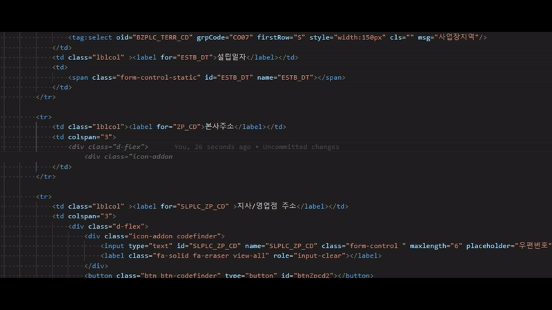

# vplusErp snippets

vplus FrameWork f/w 에 사용되는 스니펫 모음입니다.

intellisense에서 사용할 스니펫을 선택하고 `tab`키를 눌러 스니펫에 지정된 값으로 이동, 입력할 수 있습니다.

## Demo

## javascript
|Prefix|Description|
|:------:|-----------|
|`v-grd-create`|기본 시트를 생성합니다.|
|`v-grd-e-bfRowChg`|행 이동 전 변경된 내용이 있으면 알림창을 띄우는 이벤트를 추가합니다.|
|`v-grd-e-RowChg`|행 이동 후 이전 행의 변경된 내용을 조회 값으로 되돌리는 이벤트를 추가합니다.|
|`v-grd-e-btnClk`|지정한 컬럼에 팝업 클릭 코드파인더를 생성하는 이벤트를 추가합니다.|
|`v-grd-e-keyUp`|[onButtonClick-onKeyUp] 바인딩하는 이벤트를 추가합니다.|
|`v-grd-fn-postCode`|그리드 버튼에 주소 API를 바인딩합니다.|
|`v-grd-fn-upload`|그리드에 첨부파일 팝업을 바인딩합니다.|
|`v-frm-fn-postCode`|폼 input에 주소 API를 바인딩합니다.|
|`v-frm-fn-upload`|폼에 첨부파일 팝업을 바인딩합니다.|
|`v-ajax-get-grd`|그리드 조회 공통함수를 추가합니다.|
|`v-ajax-set-grd`|그리드 저장 공통함수를 추가합니다.|
|`v-ajax-getSet-grd`|그리드 조회/저장 공통함수를 추가합니다.|
|`v-ajax-get-frm`|폼 조회 공통함수를 추가합니다.|
|`v-ajax-set-frm`|폼 저장 공통함수를 추가합니다.|
|`v-util-schChk`|조회 전 변경, 필수 항목을 체크합니다.|
|`v-util-chgObjChk`|화면 내 객체들의 변경을 체크합니다.|
|`v-util-saveChk`|저장 전 변경사항이 있는지 체크합니다.|

## html
|Prefix|Description|
|:------:|-----------|
|`v-ui-vpbox`|기본 vpbox를 생성합니다.|
|`v-ui-form`|jstl 구문을 포함하는 기본 form Sample을 생성합니다.|
|`v-ui-calAutoRow`|고정 높이를 가지는 상/하 div를 생성합니다.|
|`v-ui-fixedLeftCol`|고정 넓이를 가지는 좌측 영역과 넓이가 변화는 우측 영역 기본 UI를 생성합니다.|
|`v-ui-tab`|화면 전체 탭을 기본 템플릿을 생성합니다.|
|`v-ui-tab-in-vpbox`|vpbox를 활용한 기본탭을 생성합니다.|
|`v-ui-postcode`|우편번호 input 레이아웃을 생성합니다.|
|`v-ui-dialog`|다이얼로그 레이아웃을 생성합니다.|
|`v-tag-input`|input jstl 구문을 생성합니다.|
|`v-tag-inputsimple`|필수 속성만을 가지는 input jstl 구문을 생성합니다|
|`v-tag-hidden`|hidden input jstl 구문을 생성합니다|
|`v-tag-radio`|radio jstl 구문을 생성합니다.|
|`v-tag-radioComCd`|공통코드 radio jstl 구문을 생성합니다.|
|`v-tag-checkbox`|checkbox jstl 구문을 생성합니다.|
|`v-tag-chkboxComCd`|공통코드 checkbox jstl 구문을 생성합니다.|
|`v-tag-select`|selectbox jstl 구문을 생성합니다.|
|`v-tag-selectComCd`|공통코드 selectbox jstl 구문을 생성합니다.|
|`v-tag-date`|date jstl 구문을 생성합니다.|
|`v-tag-rangeDate`|range date jstl 구문을 생성합니다.|
|`v-tag-codefind`|코드파인드 jstl 구문을 생성합니다.|

## java
|Prefix|Description|
|:------:|-----------|
|`v-con-View`|화면이동|
|`v-con-Get-Grd`|조회 - 그리드 타입|
|`v-con-Get-Frm`|조회 - 폼 타입|
|`v-con-Set-Grd`|조회 - 그리드 타입|
|`v-con-Set-Frm`|조회 - 폼 타입|
|`v-svc-Get-list`|조회 - 리스트 타입|
|`v-svc-Get-map`|조회 - 맵 타입|
|`v-svc-Set-list`|저장 - 리스트 타입|
|`v-svc-Set-list-map`|저장 - 리스트 타입|
|`v-svc-Set-map`|저장 - 맵 타입|
|`v-imp-Get-list`|조회 - 리스트 타입|
|`v-imp-Get-map`|조회 - 리스트 타입|
|`v-imp-Set-list`|조회 - 리스트 타입|
|`v-imp-Set-list-map`|조회 - 리스트 타입|
|`v-imp-Set-map`|조회 - 리스트 타입|
|`v-rps-Get-void`|조회 - list|
|`v-rps-Get-list`|조회 - list|
|`v-rps-Get-map`|조회 - list|
|`v-rps-Set-map`|저장 - map|
|`v-fn-Hashmap`|HashMap - 함수|
|`v-send-Mail`|메일발송|
|`v-send-Sms`|문자발송|
|`v-log-PrivateLog`|개인정보 - 로그|
|`v-fn-Atfl-Mng`|저장 - 첨부파일 - 함수|
|`v-fn-Atfl-Di`|주입 - 첨부파일 - 함수|
|`v-fn-Session-usrId`|아이디 - 세션정보 - 함수|
|`v-fn-Session-deptCd`|아이디 - 세션정보 - 함수|
|`v-fn-Session-corpCd`|아이디 - 세션정보 - 함수|

## xml
|Prefix|Description|
|:------:|-----------|
|`v-sessin-info`|세션정보|
|`v-get-procedure`|프로시저 조회|
|`v-get-query`|쿼리 조회|
|`v-set-procedure`|프로시저 저장|
|`v-set-query`|쿼리 저장|
|`v-resultMap`|해시맵 생성|
|`v-tag-if`|TAG - IF|
|`v-tag-choose`|TAG - CHOOSE|
